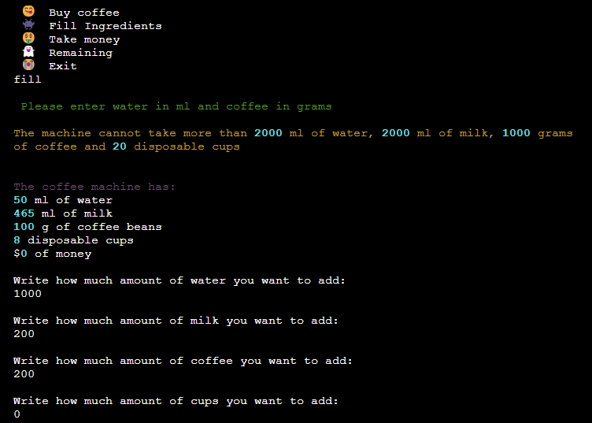

# BrewStation 

Brewstation is a Python terminal coffee simulator program, which runs in a mock terminal on Heroku.

Users can perform various actions like buy, fill or check machine status. The program displays some ASCII art and shows a coffee animation. The program is inspired by the Jetbrains Python Academy.

Live version: https://brewstation-4e76688e07ae.herokuapp.com/

## User Experience - UX

### Strategy

Python is a new language for me and I wanted to make a program that would help me be comfortable using Python programming concepts. As a big fan of coffee, animations and emoji, I decided to build a coffee machine with some ASCII art. I had build the same project in Kotlin, and decided to make it it in Python as well.

> The project has no prospective client, it is built purely for fun, engagement and learning purposes

#### User Stories
- I want to be able to understand the purpose of the program
- I want to able to make a choice from the displayed menu
- I want to able to see coffee machine stats
- I want to able to see coffee logo and animation
- I want to able to quit the program

#### User Goals
- Engage with a simple terminal program that is fun and easy to operate

#### Site Owner Goals
- Create an easy to operate, and interactive terminal program
- Add visually appealing features
- Add a fortune cookie option to engage the user
- Give an option to withdraw virtual money and exit

### Structure

The flowchart for the coffee machine simulator is as below:

## User Interface - Surface

ChatGPT was used for coffee animations. For text colors, Rich Text library was used. Coffee ASCII art is taken from https://ascii.co.uk/art/coffee with my own minor additions.

## Features

### Existing Features

- A welcome screen with ASCII art and predefined menu is displayed.

- Entering buy coffee displays options to buy or go back to main meny again.

- If enough resources, coffee animation and a success displayed.

- If not enough resources, a message specifying the resource is displayed.

- Entering take gives away collected money and money is updated.

- Entering  Remaining display machine ingredients status on that moment.

- Entering fill display machine stats and specify machine capacity and ask for amount of each ingredient

## Deployment

This project was deployed using Code Institute's mock terminal for Heroku.

### Steps
- Create an account on Heroku.
- Navigate to Heroku Dashboard and "Create a New App".
- Input App name and choose a region you are closer to.
- Select "Settings" from the table, and search for "Buildpack"
- Add "python" and "nodejs" from the list, in that order.
- Go to Deploy section, connect to GitHub.
- Seach for the repository name to connect.
- Click on Deploy Branch or enable Automatic Deploy.
- Allow a few minutes and view the deployed program.

## Technologies Used

- [Draw.io](https://app.diagrams.net/) - Used to create flowchart for the coffee machine
- [Python](https://www.python.org/) - Main language for the terminal program
- [Gitpod](https://www.gitpod.io/#get-started) - Used to code the project and save to online repo
- [Github](https://github.com/) - For version control

### Python Packages

- [Rich Text](https://pypi.org/project/rich/) - For adding colors to text
- [Art](https://pypi.org/project/art/) - For heading font style

## Credits

### Content

- [Stack Overflow](https://stackoverflow.com/questions/52335970/how-to-fix-syntaxwarning-invalid-escape-sequence-in-python) - For correcting invalid excape sequence warning
- [Jetbrains Python Academy](https://github.com/Flor91/jetbrains-python-academy/tree/master/Coffee%20Machine) - For inspiration on Coffee Machine project

### Media
- [Geeks for Geeks](https://www.geeksforgeeks.org/python-program-to-print-emojis/) - Unicodes to print emojis
- [ascii art](https://ascii.co.uk/art/coffee) - For Coffee ASCII Art
- [PythonGPT](https://openai.com/chatgpt/) - For Coffee animation code

## Acknowledgements
- [Code Institute](https://codeinstitute.net/) for Python essentials and Love Sandwiches project
- Spencer Barriball  - For his guidance and review on the project
- Code Institute Slack Community - For feedback, reviews and community support.

